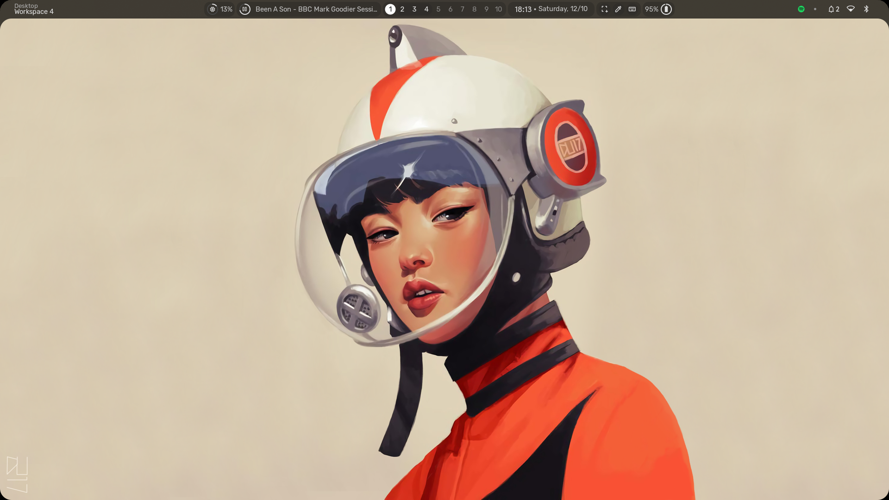
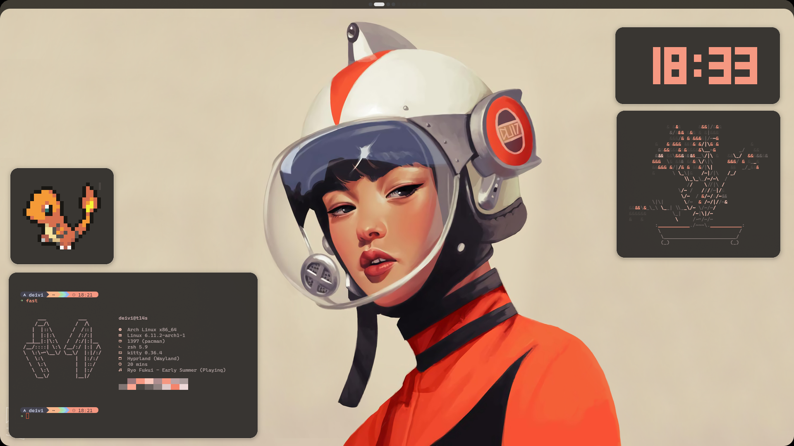
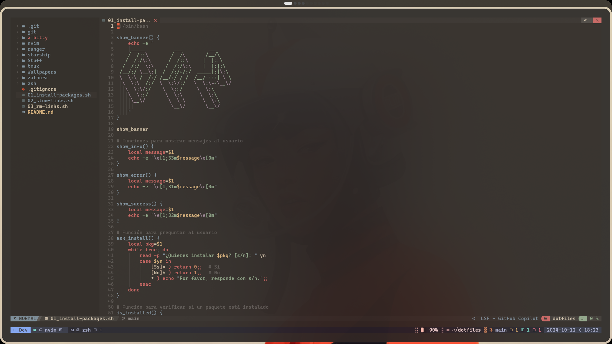
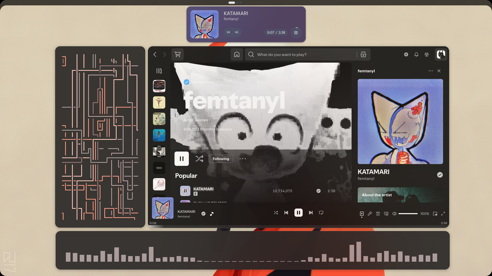
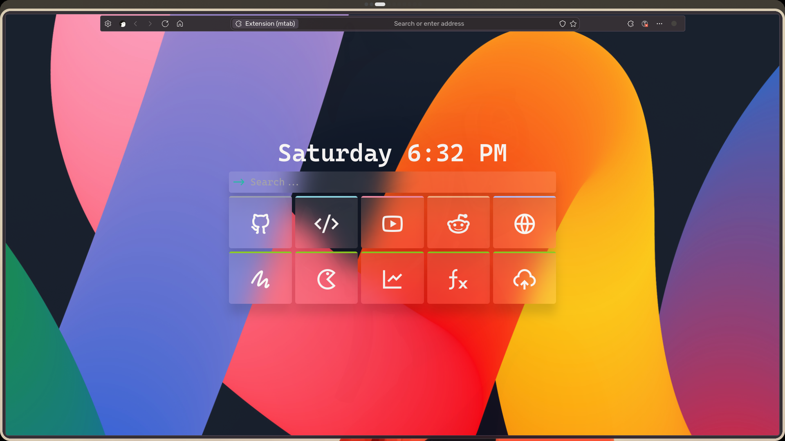
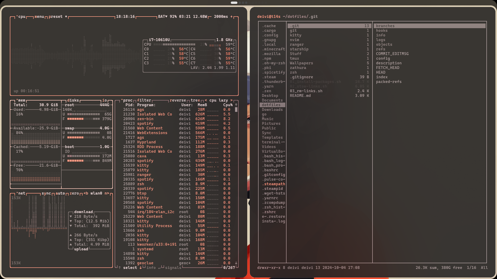

# Dotfiles

## Introduction

This repository builds upon the outstanding work of [end-4/dots-hyprland](https://github.com/end-4/dots-hyprland), providing a solid foundation for my Hyprland configuration. On top of this base, I’ve incorporated a personalized layer of customizations to enhance both functionality and aesthetics, specifically tailored to fit my workflow.

Once the base configuration is established, I apply an additional patch optimized for systems running Arch-based distributions. This setup ensures a seamless and consistent environment across multiple devices while maintaining the flexibility to adapt to unique hardware configurations and personal preferences.

## Screenshots









### Personal Setup

- **Browser**: Zen (Alpha) + Home tab extension (mtab)
- **Monospace font**: CaskaydiaCove Nerd Font Mono
- **Terminal**: Kitty
- **Editor**: Nvim Chad (+ Tmux)
- **Music**: Spotify + Spicetify personalization layer
- **Wallpaper**: [Rocket_girl](https://mega.nz/file/3lxDWIrR#Lt53rC6Y52ZjJRAejbyBqpG6eGpu577yPOfovJCAd0o)
- **My wallpaper collection**: [Wallpapers](https://mega.nz/folder/P5pygYZQ#u-x2WmRNMVpWEt8u2Xo5fQ)
- **Stickers**: [.png & .ai files](https://github.com/Deivis44/dotfiles/tree/main/Resources/Stickers)

***

## Workflow

1. Clone the repository (default: `main`)
```
git clone https://github.com/Deivis44/dotfiles.git
cd dotfiles
```

2. Switch to the device specific branch (`desktop`/`laptop`)
```
git checkout `branch`
```

3. Work on the specific branch
```
nvim `file` # Make changes
git add .
git commit -m “Changes specific to branch”
git push origin `branch`
```

4. Merge the changes from the specific branch into main WITHOUT changing branch
```
git fetch origin main # Make sure you have the latest changes to main
git push origin `branch`:main # Push changes from specific branch to main on the remote
```

***
