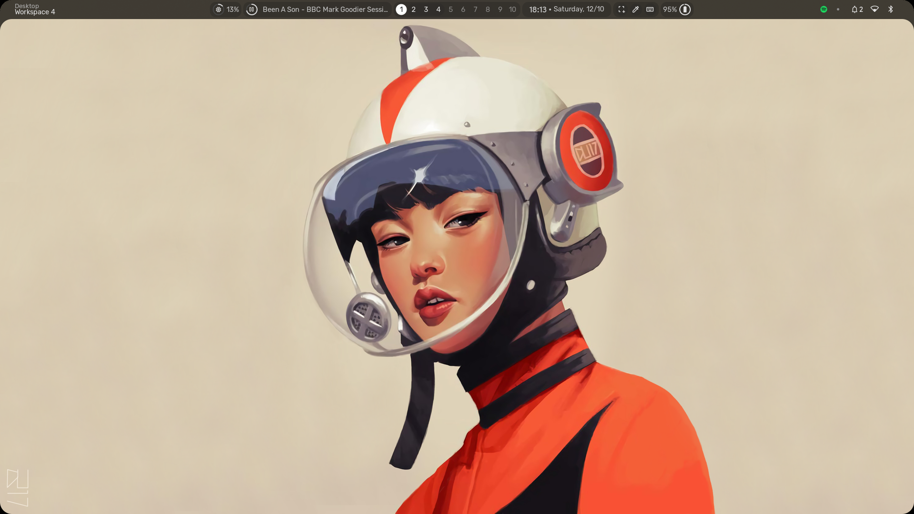
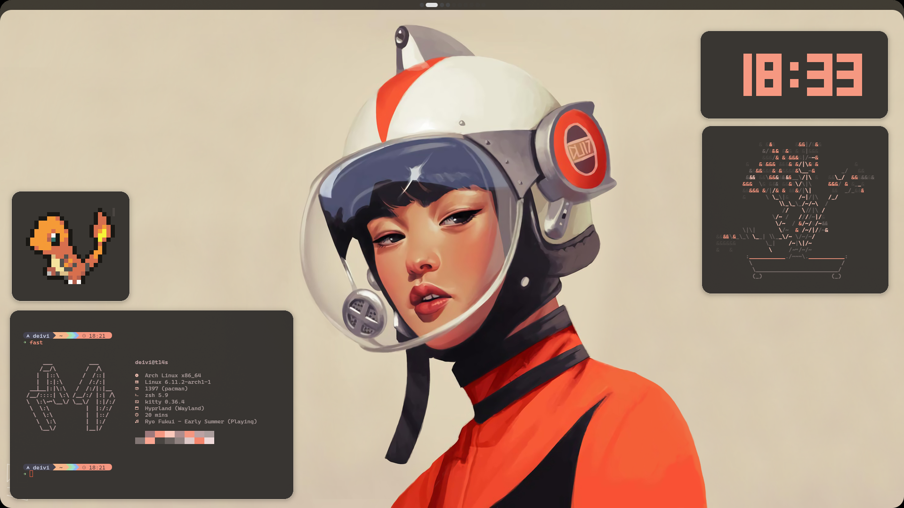
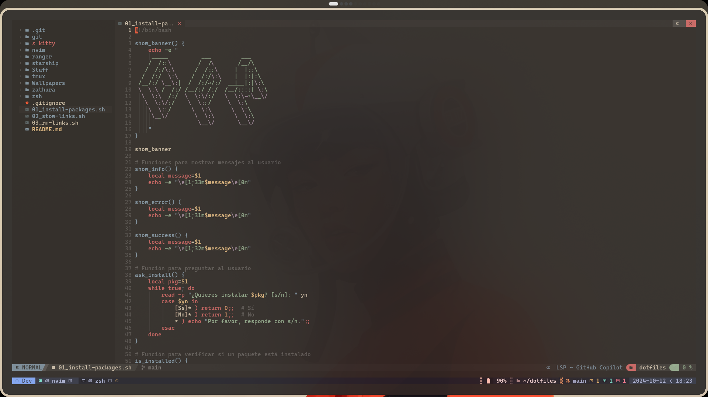
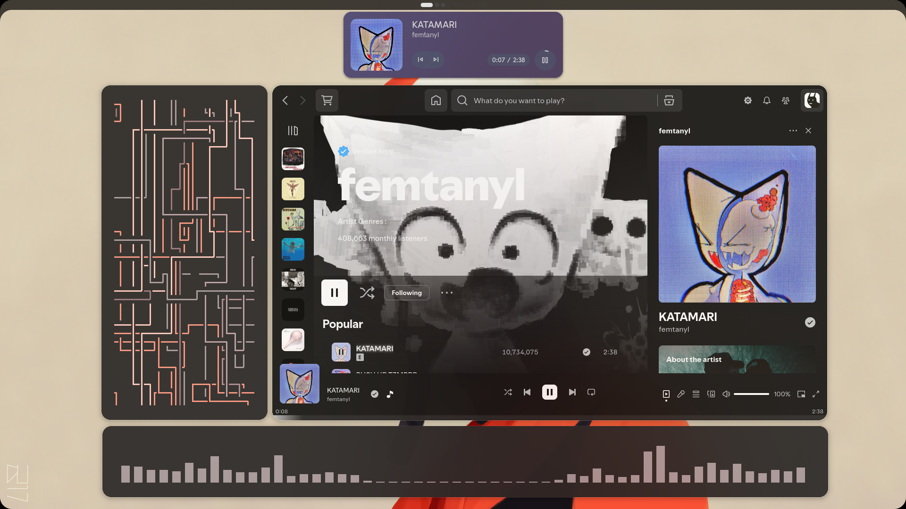

# Dotfiles

# Introducción
Este repositorio contiene mis archivos de configuración (dotfiles) para diversas aplicaciones y herramientas en mi entorno de desarrollo. El propósito es facilitar la configuración de nuevas máquinas y mantener un entorno consistente en diferentes dispositivos.

## Screenshots






***

# Personal Setup

- **Dotfiles**: [Link to the repo](https://github.com/Deivis44/dotfiles)
- **Browser**: Zen (Alpha)
- **Home tab**: mtab
- **Font**: CaskaydiaCove Nerd Font Mono
- **Terminal**: Kitty
- **Editor**: Nvim Chad (+ Tmux)
- **Music**: Spotify + Spicetify personalization layer
- **Wallpaper**: [Rocket_girl](https://github.com/Deivis44/dotfiles/blob/main/Wallpapers/rocket.png)
- **My wallpaper collection**: [Wallpapers](https://mega.nz/folder/P5pygYZQ#u-x2WmRNMVpWEt8u2Xo5fQ)
- **Sticker**: [.png & .ai editable file](https://github.com/Deivis44/dotfiles/tree/main/Stickers)

## Credits
Credits to this repo: [https://github.com/end-4/dots-hyprland](https://github.com/end-4/dots-hyprland), I modified it while learning Linux stuff with reverse engineering. (I'm working on my own status bar using that base)

***

# Clonar el Repositorio
Para comenzar, clona el repositorio en tu directorio home:

```bash
cd ~
git clone https://github.com/tu-usuario/dotfiles.git
cd dotfiles
```

## Estructura del Repositorio
La estructura refleja las ubicaciones deseadas de los archivos de configuración en tu sistema:

```plaintext
dotfiles/
├── zsh/
│   └── .zshrc
├── tmux/
│   └── .config/
│       └── tmux/
│           └── tmux.conf
└── ranger/
    └── .config/
        └── ranger/
            └── rc.conf
```

## Scripts de Configuración

### 1. `install_packages.sh`
Este script instala los paquetes necesarios para tu entorno de desarrollo.

**Instrucciones:**
1. Dar permisos de ejecución:
   ```bash
   chmod +x install_packages.sh
   ```
2. Ejecutar el script:
   ```bash
   ./install_packages.sh
   ```

**¿Qué hace?**
- Instala los paquetes necesarios utilizando el gestor de paquetes adecuado.

### 2. `stow_links.sh`
Este script crea enlaces simbólicos para los dotfiles en las ubicaciones correctas.

**Instrucciones:**
1. Dar permisos de ejecución:
   ```bash
   chmod +x stow_links.sh
   ```
2. Ejecutar el script:
   ```bash
   ./stow_links.sh
   ```

**¿Qué hace?**
- Crea enlaces simbólicos usando GNU Stow para gestionar la configuración.

### 3. `rm_links.sh`
Este script elimina los enlaces simbólicos creados por `stow_links.sh`.

**Instrucciones:**
1. Dar permisos de ejecución:
   ```bash
   chmod +x rm_links.sh
   ```
2. Ejecutar el script:
   ```bash
   ./rm_links.sh
   ```

**¿Qué hace?**
- Elimina los enlaces simbólicos y opcionalmente restaura los archivos de backup.

## Manejo de Archivos de Configuración Existentes

Si ya tienes archivos de configuración en tu máquina, sigue estos pasos para gestionarlos:

1. **Copia el archivo al repositorio:**
   ```bash
   cp ~/.config/tmux/tmux.conf ~/dotfiles/tmux/.config/tmux/
   ```
2. **Haz un backup del archivo local:**
   ```bash
   mv ~/.config/tmux/tmux.conf ~/.config/tmux/tmux.conf.backup
   ```
3. **Ejecuta `stow_links.sh`** para crear los enlaces simbólicos.

## Añadir Más Dotfiles
1. **Copia el archivo al repositorio:**
   ```bash
   cp ~/.vimrc ~/dotfiles/vim/
   ```
2. **Haz un backup del archivo local:**
   ```bash
   mv ~/.vimrc ~/.vimrc.backup
   ```
3. **Ejecuta `stow_links.sh`** para crear los enlaces simbólicos.

## Resumen de Scripts

### `install_packages.sh`
- Instala paquetes necesarios.

### `stow_links.sh`
- Crea enlaces simbólicos para los dotfiles.

### `rm_links.sh`
- Elimina enlaces simbólicos y restaura backups.

## Desinstalación de Configuraciones

Para deshacer los cambios realizados por los scripts de instalación:

1. **Ejecuta `rm_links.sh`:**
   ```bash
   ./rm_links.sh
   ```

**¿Qué hace?**
- Elimina los enlaces simbólicos y restaura los archivos respaldados.
